# FROST: Flexible Round-Optimized Schnorr Threshold Signatures

**Another crazy way to use Schnorr**

  joaozinhom

---

  

    
  

  

    <h2 class="text-2xl font-bold mb-4">Joãozinho</h2>
    

      Open sats grant working on krux-installer, and studying in 42 school.
    

  

---

  <h2 class="text-4xl font-bold mb-10 text-green-400 self-start">What is this FROST?</h2>

  <ul class="text-xl leading-relaxed text-gray-200 space-y-8">
    <li>• Its a Schnorr scheme that uses to have multisigs n-of-m</li>
    <li>• Its different from Nunchuck scheme that uses Taproot, and its different from simple Musigs</li>
    <li>• Like simple Musigs and Nunchuck schemes its not possible to an external observer know how many participants are in this contract and even how many sign</li>
  </ul>

---

  <h2 class="text-2xl font-bold pt-10 px-12 text-blue-400">Why FROST?</h2>
  

    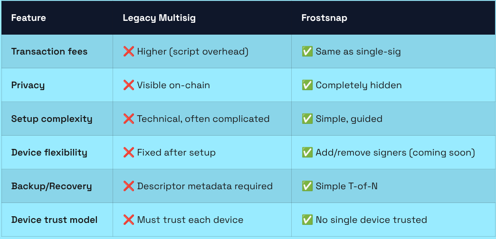
  

---
layout: center
class: text-center
---

  
📖

  <h2 class="text-5xl font-bold text-yellow-300">Notations</h2>
  
Variables and symbols used throughout the protocol

---

  <h2 class="text-2xl font-bold pt-10 px-12 text-yellow-300">Notations</h2>
  

    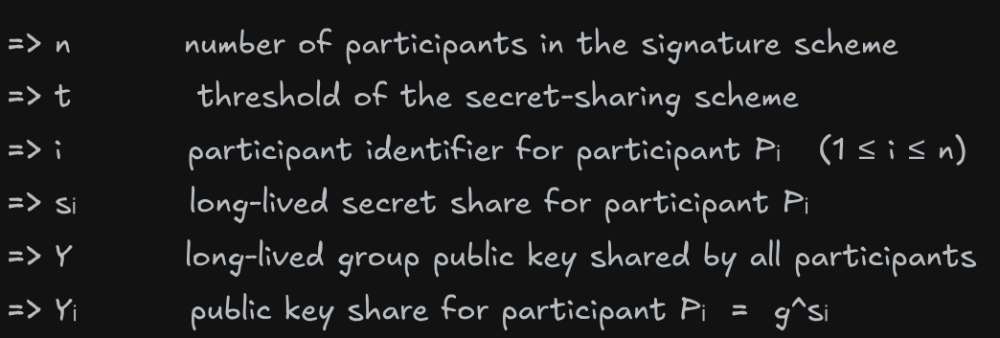
  

---

  <h2 class="text-2xl font-bold pt-10 px-12 text-yellow-300">Notations</h2>
  

    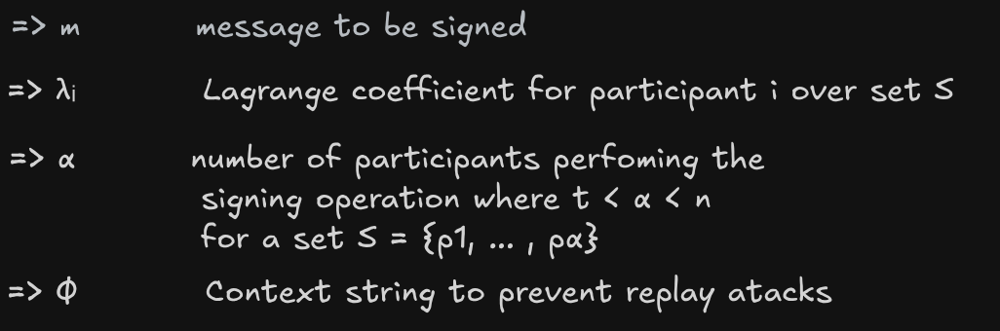
  

---
layout: center
class: text-center
---

  
🔑

  <h2 class="text-5xl font-bold text-blue-300">KeyGen</h2>
  
Distributed key generation — no trusted dealer

---
layout: center
class: text-center
---

  <h2 class="text-4xl font-bold text-blue-300">KeyGen — Round 1</h2>
  
Each participant generates their own polynomial and broadcasts commitments

---

  <h2 class="text-2xl font-bold pt-10 px-12 text-blue-300">KeyGen — Round 1</h2>
  

    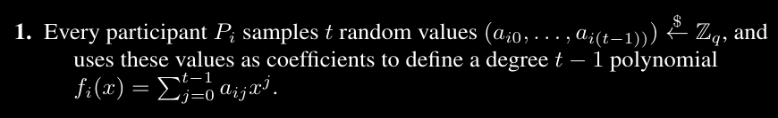
  

---

  <h2 class="text-2xl font-bold pt-10 px-12 text-blue-300">KeyGen — Round 1</h2>
  

    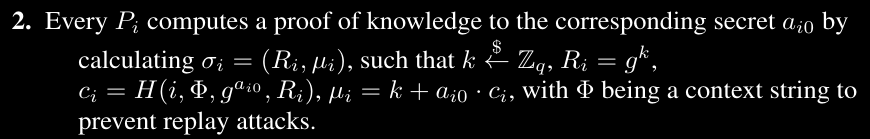
  

---

  <h2 class="text-2xl font-bold pt-10 px-12 text-blue-300">KeyGen — Round 1</h2>
  

    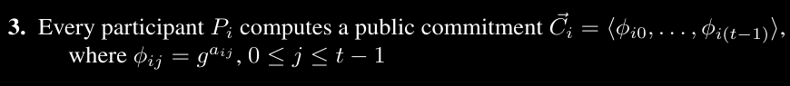
  

---

  <h2 class="text-2xl font-bold pt-10 px-12 text-blue-300">KeyGen — Round 1</h2>
  

    
  

---

  <h2 class="text-2xl font-bold pt-10 px-12 text-blue-300">KeyGen — Round 1</h2>
  

    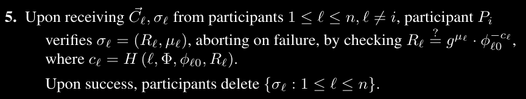
  

---
layout: center
class: text-center
---

  <h2 class="text-4xl font-bold text-green-300">KeyGen — Round 2</h2>
  
Each participant assembles their secret share — nobody ever holds the full key

---

  <h2 class="text-2xl font-bold pt-10 px-12 text-green-300">KeyGen — Round 2</h2>
  

    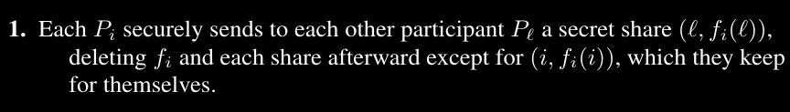
  

---

  <h2 class="text-2xl font-bold pt-10 px-12 text-green-300">KeyGen — Round 2</h2>
  

    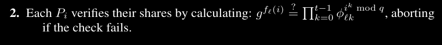
  

---

  <h2 class="text-2xl font-bold pt-10 px-12 text-green-300">KeyGen — Round 2</h2>
  

    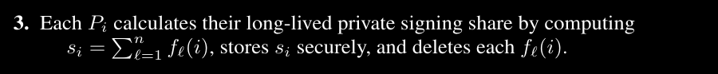
  

---

  <h2 class="text-2xl font-bold pt-10 px-12 text-green-300">KeyGen — Round 2</h2>
  

    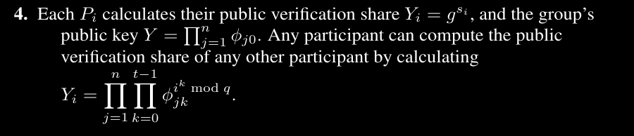
  

---
layout: center
class: text-center
---

  
⚙️

  <h2 class="text-5xl font-bold text-orange-300">Preprocess</h2>
  
Generating one-time nonces before signing

---

  <h2 class="text-2xl font-bold pt-10 px-12 text-orange-300">Preprocess</h2>
  

    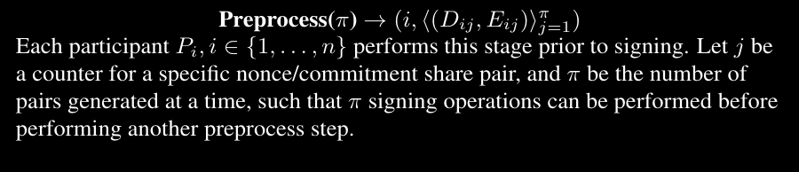
  

---

  <h2 class="text-2xl font-bold pt-10 px-12 text-orange-300">Preprocess</h2>
  

    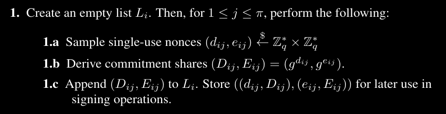
  

---

  <h2 class="text-2xl font-bold pt-10 px-12 text-orange-300">Preprocess</h2>
  

    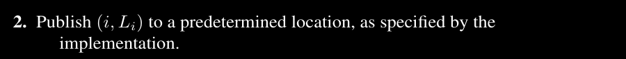
  

---
layout: center
class: text-center
---

  
✍️

  <h2 class="text-5xl font-bold text-red-300">Signing</h2>
  
Single-round threshold signing — indistinguishable from single-signer Schnorr

---

  <h2 class="text-2xl font-bold pt-10 px-12 text-red-300">Sign(m) → (m, σ)</h2>
  

    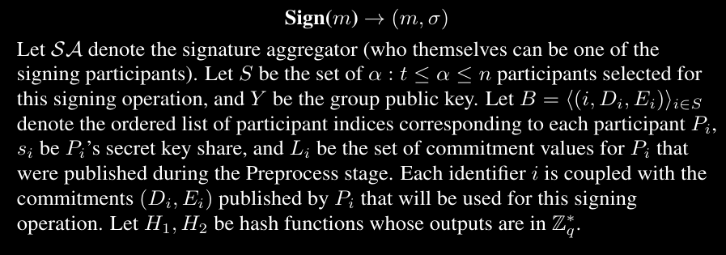
  

---

  <h2 class="text-2xl font-bold pt-10 px-12 text-red-300">Sign(m) → (m, σ)</h2>
  

    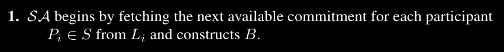
  

---

  <h2 class="text-2xl font-bold pt-10 px-12 text-red-300">Sign(m) → (m, σ)</h2>
  

    
  

---

  <h2 class="text-2xl font-bold pt-10 px-12 text-red-300">Sign(m) → (m, σ)</h2>
  

    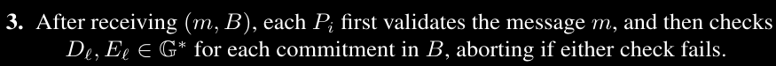
  

---

  <h2 class="text-2xl font-bold pt-10 px-12 text-red-300">Sign(m) → (m, σ)</h2>
  

    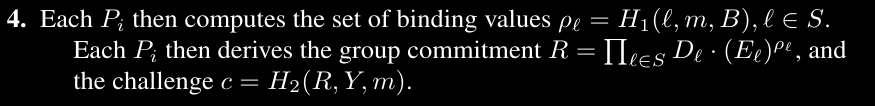
  

---

  <h2 class="text-2xl font-bold pt-10 px-12 text-red-300">Sign(m) → (m, σ)</h2>
  

    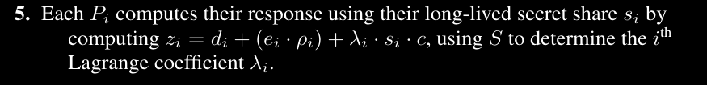
  

---

  <h2 class="text-2xl font-bold pt-10 px-12 text-red-300">Sign(m) → (m, σ)</h2>
  

    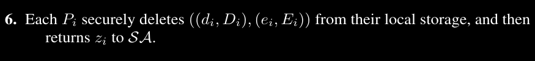
  

---

  <h2 class="text-2xl font-bold pt-10 px-12 text-red-300">Sign(m) → (m, σ)</h2>
  

    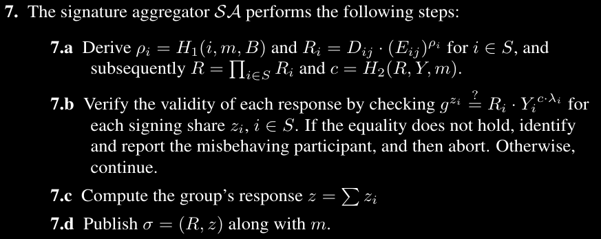
  

---
  

  

