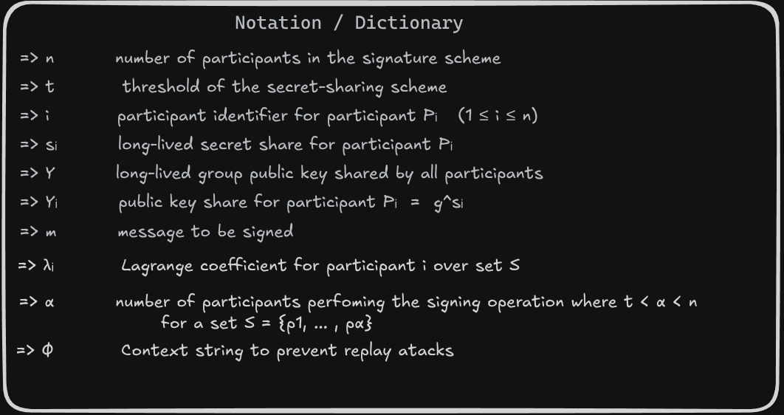
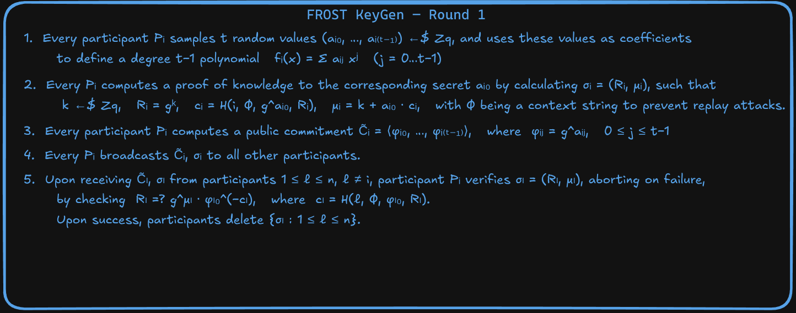
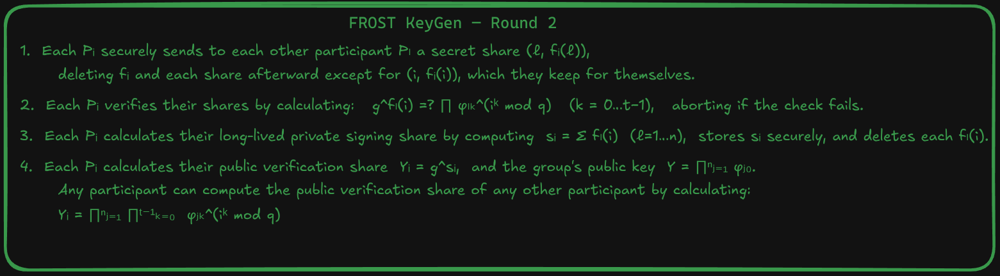
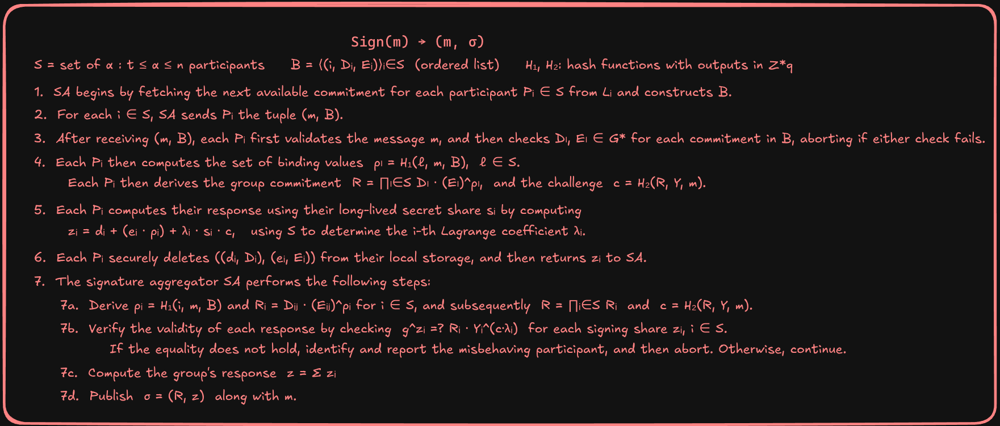

# FROST: Flexible Round-Optimized Schnorr Threshold Signatures

**Another crazy way to use Schnoor**

  joaozinhom

---

  

    
  

  

    <h2 class="text-2xl font-bold mb-4">Joãozinho</h2>
    

      Open sats grante working on krux-installer, and studying in 42 school.
    

  

---

  

    <h2 class="text-2xl font-bold mb-6 text-blue-400">Por que FROST?</h2>
    <ul class="text-sm leading-loose text-gray-200 space-y-3">
      <li>• ponto 1 — diferença de outras implementações</li>
      <li>• ponto 2 — limitação dos esquemas anteriores</li>
      <li>• ponto 3 — o problema de paralelismo</li>
      <li>• ponto 4 — o ataque de Drijvers</li>
    </ul>
  

  

    
  

---

  

    <h2 class="text-2xl font-bold mb-6 text-green-400">Como funciona conceitualmente</h2>
    <ul class="text-sm leading-loose text-gray-200 space-y-3">
      <li>• ponto 1 — threshold e secret sharing</li>
      <li>• ponto 2 — polinômio e shares</li>
      <li>• ponto 3 — ninguém tem a chave completa</li>
      <li>• ponto 4 — assinatura indistinguível de single-signer</li>
    </ul>
  

  

    
  

---

  <h2 class="text-xl font-bold mb-6 text-blue-300 self-start">Notations</h2>

  

  

    legenda / comentário sobre esse bloco de fórmulas
  

---

  <h2 class="text-xl font-bold mb-6 text-blue-300 self-start">KeyGen — Round 1</h2>

  

  

    legenda / comentário sobre esse bloco de fórmulas
  

---

  <h2 class="text-xl font-bold mb-6 text-green-300 self-start">KeyGen — Round 2</h2>

  

  

    legenda / comentário sobre esse bloco de fórmulas
  

---

  <h2 class="text-xl font-bold mb-6 text-red-300 self-start">Sign(m) → (m, σ)</h2>

  

  

    legenda / comentário sobre esse bloco de fórmulas
  

---

  

